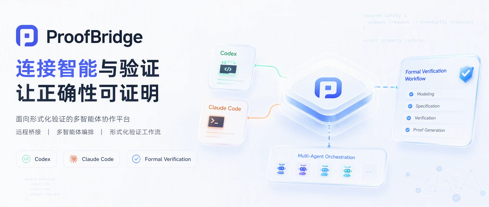

# ProofBridge

<p align="center">
  
</p>

<p align="center"><strong>让浏览器安全访问私有机器上的 Codex 与 Claude Code，并进行多 CLI 编排。</strong></p>

<p align="center">
  <a href="https://github.com/Atingaii/ProofBridge/actions/workflows/ci.yml?query=branch%3Amain"></a>
  <a href="go.mod"></a>
  <a href="docs/deployment.md"></a>
</p>

<p align="center">
  <a href="README.zh-CN.md">中文接入指南</a> ·
  <a href="https://sparkon.cn/help">在线图文教程</a> ·
  <a href="docs/deployment.md">部署指南</a> ·
  <a href="docs/architecture.md">架构说明</a>
</p>

ProofBridge 将公网 Hub 与私有工作区分离：Hub 负责浏览器访问、认证和历史持久化；
Bridge 从你的机器反向连接 Hub，并在本地工作目录中运行 Codex、Claude Code 等 CLI。
Hub 不需要访问你的文件系统，也不需要保存模型密钥。

```text
浏览器 ── WSS ──> 公网 Hub <── 反向 WS ── Bridge（你的机器） ──> Codex / Claude Code
```

## 核心能力

- 一个 Go 二进制，提供 `hub` 公网服务和 `bridge` 私有端两种运行模式。
- Hub 内嵌静态 Web UI，使用 SQLite 保存用户、会话、消息、编排事件和用量记录。
- Bridge 通过反向 WebSocket 主动连接 Hub，不要求私有机器开放入站端口。
- 支持 Codex、Claude Code、ACP 常驻会话和确定性的 `echo` runner。
- 支持单 CLI 对话，以及 Codex 与 Claude Code 之间的多轮协作、辩论和形式化证明编排。
- 浏览器断开后保留会话租约；在 TTL 内重新打开相同会话，可继续原生 CLI 上下文。
- 记录输入、输出、缓存读取、缓存写入和推理 Token，并按机器、项目、模型和编排任务汇总。
- 提供管理员用量面板，按用户查看活跃状态、在线端点、任务规模、Token 与官方 API 标价估算。
- 支持浏览器端命令/文件审批、端点修复命令、原生 `resume` 和移动端 WebView 包装。
- 提供可选“自动执行（仅工作区）”模式，以 Linux Landlock 限制 CLI 及子进程越界读取或写入。

## 运行要求

| 用途 | 要求 |
| --- | --- |
| 从源码构建 | Go 1.25+、Node.js 20+ |
| 运行 Bridge | 已安装并完成认证的 Codex CLI 和/或 Claude Code |
| 运行生产 Hub | TLS 终止反向代理，例如 Caddy 或 Nginx |

Web UI 会编译进 Go 二进制。从源码构建时先运行 `make frontend`，或直接运行
`make build-all` 刷新嵌入资源。

## 快速开始

```bash
git clone https://github.com/Atingaii/ProofBridge.git
cd ProofBridge

cp configs/dev.yaml.example configs/dev.yaml
# 编辑 configs/dev.yaml，设置 auth.bootstrap_password 和随机 jwt_secret

go run . user --username admin --password 'change-me'
go run . enroll
# 将输出的 token 写入 configs/dev.yaml 的 bridge.token
```

分别打开两个终端启动 Hub 和 Bridge：

```bash
make run-hub
make run-bridge
```

然后访问 <http://127.0.0.1:8088>。使用 Codex 时，在配置中设置：

```yaml
bridge:
  runner: codex
  cwd: /path/to/workspace
  sandbox: danger-full-access
  approval_policy: never
```

需要常驻 Agent 会话时，将 `bridge.runner` 设为 `acp`，并参考
[ACP runner 文档](docs/features/acp-runner.md)。

## 用户侧接入

生产 Hub 的设置页面会生成一条“安装并连接”命令。进入目标工作目录后，用与本地 CLI
相同的系统用户执行即可。命令会安装或更新 Bridge，并优先启动 `systemd --user` 服务；
没有 user systemd 时会退回后台进程。

```bash
# 直接执行网页设置页生成的单行命令
```

Bridge 日志位于 `~/.codex-bridge/logs/`。安装命令会保留当前 shell 的 `HOME`、`PATH`、
`CODEX_HOME`、Claude 配置目录、模型凭据和代理变量，避免后台服务与前台 CLI 使用不同环境。
Bridge 只有在日志确认 `[bridge] connected` 后才会报告连接成功。
页面安装命令保持为简短的一行；下载安装器后会立即显示二进制下载进度，并在网络停滞时超时重试。以后再次执行页面原有的安装命令即可更新：它会原子替换 Bridge，自动重启当前用户已有的
连接服务；无需额外执行 `systemctl`、结束旧进程或安装另一个守护程序。页面拆分显示安装和
连接两条命令时，新机器各执行一次，后续升级只需重跑安装命令。

同一个浏览器会话使用同一个 `sid`，后续消息会复用同一个本地 CLI/ACP 进程。浏览器关闭后，
在租约 TTL 内重新打开相同会话即可继续；事后也可以在相同工作目录中使用 `codex resume` 或
Claude Code 的 `/resume` 查看 CLI 自己落盘的原生记录。

## 部署方式

| 方式 | 适用场景 | 入口 |
| --- | --- | --- |
| 源码运行 | 本地开发、单机测试 | [快速开始](#快速开始) |
| Make 构建 | 可重复的本地或预发布构建 | [构建与安装](#构建与安装) |
| Portable 包 | 拷贝到 Linux 服务器后解压运行 | [部署指南](docs/deployment.md#option-c--portable-package) |
| Docker | 容器化运行 Hub | [部署指南](docs/deployment.md#option-d--docker) |
| systemd + Caddy | 带 TLS 的生产环境 | [部署指南](docs/deployment.md#option-e--production-systemd--caddy) |

完整的生产配置、反向代理、验证和排错步骤见 [docs/deployment.md](docs/deployment.md)。

## 构建与安装

```bash
make test
make build-all                 # 构建前端并生成 bin/codex-bridge
./bin/codex-bridge hub
sudo make install              # 可选：安装到 /usr/local/bin
```

构建 portable 包：

```bash
make portable-package
scp dist/codex-bridge-*-linux-amd64.tar.gz user@server:/opt/
```

生产环境必须替换默认密码和 JWT secret，并将 Hub 放在 HTTPS 反向代理后面。配置文件、
环境变量和 systemd 示例统一见 [开发与部署工作流](docs/dev-workflow.md)。

## 自建 Hub 的常用命令

```bash
codex-bridge hub
codex-bridge user --username admin --password '...'
codex-bridge enroll --ttl 24h

codex-bridge link <token>       # 安装并作为后台服务连接，推荐
codex-bridge connect <token>    # 前台连接，用于调试
codex-bridge bridge             # 使用配置文件连接
```

## 界面与编排

登录后可以在设置页管理多个 CLI 端，并在顶部切换目标机器。编排页支持默认模式和
形式化证明模式；每一轮会记录参与角色、结构化事件、命令证据、Token 用量和最终结论。
只有显式点击“新运行”才会创建新的编排上下文，继续输入会沿用当前 `runID`。

“需要确认”会把命令/文件审批回传到浏览器；“自动执行（仅工作区）”无需审批，并使用 Linux
Landlock 隔离用户目录：绑定工作区可写，系统运行时、Home 隐藏项、PATH 和可识别公共工具只读，
其他未识别普通 Home 目录不可见；严格模式关闭 Codex 内层 Bubblewrap，由不可放宽的 Bridge 外层规则覆盖所有子进程；“无需授权”保持原可信机器模式。严格模式要求支持 Landlock ABI 3 的 Linux 内核，特殊工具链可用
`BRIDGE_STRICT_WORKSPACE_READ_ONLY` 增加只读根。删除在线端点时，Hub 会先要求本地 Bridge
停止对应服务，再撤销端点和 token。

bootstrap 管理员可通过工作区盾牌图标进入 `/admin/usage`。管理员用量面板支持 7 天、30 天、
90 天及全部时间范围，展示用户活跃状态、在线 Bridge、聊天与编排任务、模型调用、输入/输出/
缓存/总 Token 和官方 API 标价费用趋势，并支持用户搜索与排序。点击用户可进入只读详情，
按标题查看该用户的聊天会话与编排任务、状态、端点、活动时间及每条对话用量；继续点击对话
可按需查看消息正文和编排提示词。本地路径、原生 CLI Session ID 与可写操作不会开放，普通
用户仍只能访问自己的数据，也不能进入管理员页面或接口。

## 文档

- [中文接入指南](README.zh-CN.md)：SparkAPI Hub、ACP、resume 和常见使用流程
- [在线图文教程](https://sparkon.cn/help)：注册、接入、对话、编排、证明和排错
- [部署指南](docs/deployment.md)：源码、Portable、Docker、systemd + Caddy
- [架构说明](docs/architecture.md)：组件、数据流和协议
- [开发工作流](docs/dev-workflow.md)：环境变量、YAML 配置和本地开发
- [代码地图](docs/code-map.md)：修改不同模块时需要同步的文件
- [管理员用量面板](docs/features/admin-usage-dashboard.md)：权限、统计口径和隐私边界
- [功能设计](docs/features/)：各项用户功能的设计文档

## 开发约定

非平凡的架构、协议、持久化和用户功能改动需要先更新 ADR 或功能设计文档；提交前请检查
`docs/change-impact.md`，并运行：

```bash
make doc-lint
go test ./...
```

具体规则见 [AGENTS.md](AGENTS.md)。
